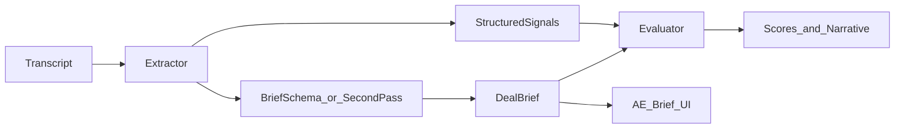

# AE-level awareness vs current pipeline

**Branch:** `feature/ae-parity-deal-brief`  
**Purpose:** Spec for closing the gap between human AE judgment (detail, synthesis, reasoning) and what the pipeline captures—using one rich transcript as an illustration, not an industry-specific case.

## Follow-up work (tracked)

- Optionally diff live `extracted_signals` + `evaluation_json` for a sample call against an AE-written brief.
- Design structured deal-brief + flexible stack/inventory fields (multi-tool, initiatives, discovery) separate from BANT-only shapes.
- Strengthen evaluator inputs (richer brief) and rubric so scoring tracks AE-style synthesis.
- Surface an AE-oriented brief view in the UI (structured fields + evidence).

---

## Intent

The product goal is **general**: the system should be as **aware**, **complete**, and **good at reasoning** about a call as a strong AE—or better. The San José State example is **one illustrative transcript** with many concrete details; the takeaways below are **systemic** (schema, extraction philosophy, surfacing), **not** “higher ed is special.” Industry-specific rubric lines in prompts exist in the repo but are **not** the center of this audit.

## What “processed before evaluator” means in this codebase

The **extractor** ([`packages/core/src/extraction/schemas.ts`](../packages/core/src/extraction/schemas.ts) + [`packages/core/src/prompts/extractor_v4.txt`](../packages/core/src/prompts/extractor_v4.txt)) produces structured `ExtractedSignals`. The **evaluator** ([`packages/core/src/prompts/evaluator_v3.txt`](../packages/core/src/prompts/evaluator_v3.txt)) consumes those signals plus `MeetingContext` and produces BANT scores, `stage_1_probability`, flags, and narrative fields like `call_notes`.

So: anything **not representable** in `ExtractedSignals`, or **never promoted** into a narrative the UI emphasizes, will be **missing or compressed** downstream—even when the transcript is rich.

## Illustrative call: AE recap vs transcript (ground truth)

The AE-style bullets for that call are well-supported in the pasted transcript:

- **Contacts / roles**: functional ownership (e.g. desktop support scope ~80–85% of campus) vs formal titles.
- **Stack**: many named tools (ITSM, workspace, chat intake, MDM/patch, KB, security).
- **Why now**: leadership change, budget to improve, active evaluation.
- **Scope**: who is covered (e.g. broad constituencies); how requests actually arrive (channels, shadow workflows).
- **Pains**: logging gaps, portal gaps, onboarding sprawl, data-quality / mapping complexity.
- **What they care about in the product**: KB deflection, playbooks/automation, departmental segmentation—plus **parallel** threads (e.g. CMDB) and **how they found you** (discovery path).

## What the extractor can represent well—when the model fills it

These have **direct or partial** homes in today’s schema:

- **Account / org naming**: `account.company_name`.
- **Competitive mentions**: `account.competitors_mentioned`.
- **Pain list**: `need.pain_points` (array)—*if* enumerated.
- **Stack (partial)**: `account.tech_stack` booleans + a few string slots.
- **Timing / next steps**: `timing.*`, qualification booleans where applicable.

## Systematic gaps (why AEs still “see more”)

These apply **across accounts**; they explain AE > automation, not one sector.

### 1) Schema expressiveness caps detail

- **Closed or narrow tool slots** (e.g. ITSM as a short list in the prompt) → real-world names (**iSupport**, niche tools) become **`unknown`** or collapsed.
- **Cardinality**: one **MDM-style** string vs **multiple** endpoint/patch tools in one account.
- **No home for whole categories** (e.g. security scanning/EPP) → those details only appear if the model **stuff**s them into prose (`call_summary`, `current_solution`) or drops them.
- **No structured slots for**: parallel initiatives (CMDB, platform swap + automation layer), **discovery / how they found you**, or **“what they want to see next”** as a capability list—so synthesis that an AE puts in a brief has nowhere consistent to land.

### 2) Extraction philosophy vs AE synthesis

From [`extractor_v4.txt`](../packages/core/src/prompts/extractor_v4.txt):

- **“NEVER guess or infer beyond what is explicitly stated”** favors **precision over integrative story**. AEs constantly **weave** threads (“why now”, “what matters most”, “what to demo next”) across the hour.
- **`call_summary`** is the natural pressure valve, but it is **not** a first-class **deal brief** schema—and the UI may not treat it as the primary scan surface.
- **Participant rules** (only explicit titles/roles) conflict with **functional role descriptions** (“I manage X covering Y%”) that AEs treat as contact context.

Net: the model can be **technically compliant** yet **less holistically aware** than an AE reading the same text.

### 3) Evaluator is only as good as the structured input + rubric shape

The second LLM **reasons on `ExtractedSignals`**, not on raw transcript. If inventory, catalysts, and initiative threads were **lost or compressed** in step one, the evaluator cannot magically restore AE-level situational awareness—only approximate it in `call_notes` if prompted to, with no guarantee.

Separately, the rubric is **BANT- and motion-weighted**; an AE’s internal brief is **multi-axis** (stack map, acute pains, power map, next demo hooks). When those axes aren’t structured inputs, **reasoning quality hits a ceiling**.

### 4) Surfacing: BANT-first UI vs AE scan patterns

[`CallDetailTabs`](../apps/web/components/CallDetailTabs.tsx) prioritizes **evaluator output + BANT + tables**. Dense operational truth may live in **`call_summary`** or deep in JSON. An AE optimizes for a **single readable brief**; the product often optimizes for **scoring**—same data, different **information architecture**.

## Illustrative checklist vs current design (example call)

| AE lens | Risk in pipeline |
|--------|-------------------|
| Contact nuance (function vs title) | Under-captured if strict title rules win |
| Full stack / security / multi-tool | Collapsed or absent: narrow taxonomy + single slots |
| Why now / catalyst | Prose-only unless model threads into need/timing fields |
| Scope & intake reality | Needs enumeration; no dedicated “scope + channels” object |
| Many distinct pains | Possible via `pain_points`; risk of under-enumeration |
| Product interest & demo hooks | No `capabilities_interest[]`; easy to dilute |
| Parallel tracks (e.g. CMDB), discovery | No dedicated fields → high drop rate |

## Production-grade direction (systematic)

- **Deal-brief schema** (or second-pass “brief builder”) that mirrors how AEs summarize: **contacts, stack inventory, catalyst, pains, what they want to see, risks, next step**—each with **evidence pointers**, not replacing BANT but **feeding** it.
- **Flexible inventory fields**: free-text or multi-value tools, collaboration channels beyond a fixed boolean pair, optional security/observability layer—so nothing forces harmful collapse.
- **Two-pass extraction** if needed: pass A = faithful facts; pass B = **allowed, evidence-grounded synthesis** (“why this matters”, “top 3 takeaways”) with explicit quotes.
- **Evaluator** consumes the brief + signals so **reasoning** (stage probability, coaching) tracks **the same story** an AE would tell.
- **UI**: prominent **AE Brief** pane fed by that object.

## Verification

This audit is **design- and transcript-based** against checked-in prompts/schemas. To **measure** gap on any call, compare an AE-written brief to `extracted_signals.signals_json` + `evaluations.evaluation_json` for that `call_id`.
