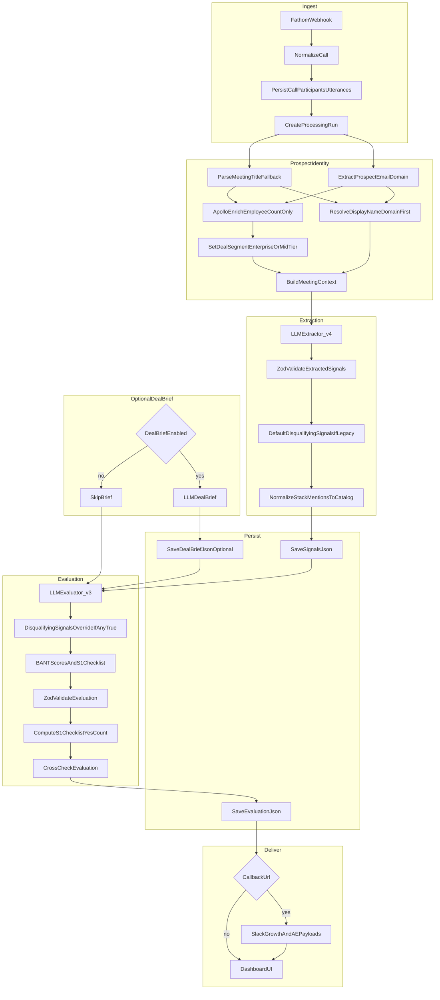
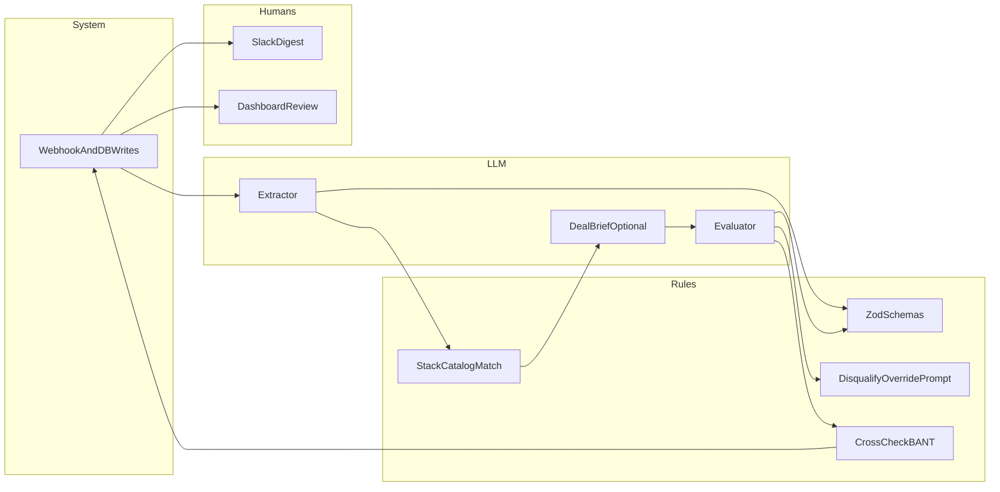

# Executive pipeline flow (Console call analyzer)

Single-page reference for Stage 0 call processing. **Download:** use *Save As* on this file, or open on GitHub and use *Raw* → save.

## High-level flow

## Swimlane view (roles)

## Key decision points (executive)

| Step | What happens |
|------|----------------|
| Identity | Company label from **email domain first**, title fallback; Apollo only for **employee count → segment**. |
| Extract | Structured BANT + account + qualification + **`disqualifying_signals`** + stack mentions. |
| Post-extract | **`stack_canonical_hits`** from internal catalog; legacy rows get **default disqualifying block**. |
| Evaluate | If **any** `disqualifying_signals.value` is true → **Unqualified**, **not_s1**, **stage_1_probability ≤ 10**, first red flag **`DISQUALIFIED: …`**; else normal BANT + S1 checklist. |
| Output | Supabase + optional **callback** (Slack-style payloads) + **dashboard**. |

## Export as PNG/SVG

1. Copy either `flowchart` code block above (without the \`\`\` lines).
2. Open [https://mermaid.live](https://mermaid.live), paste, then **Actions → PNG/SVG**.

---

*Generated for handoff; keep in sync when changing `extractor_v4`, `evaluator_v3`, or ingestion.*
